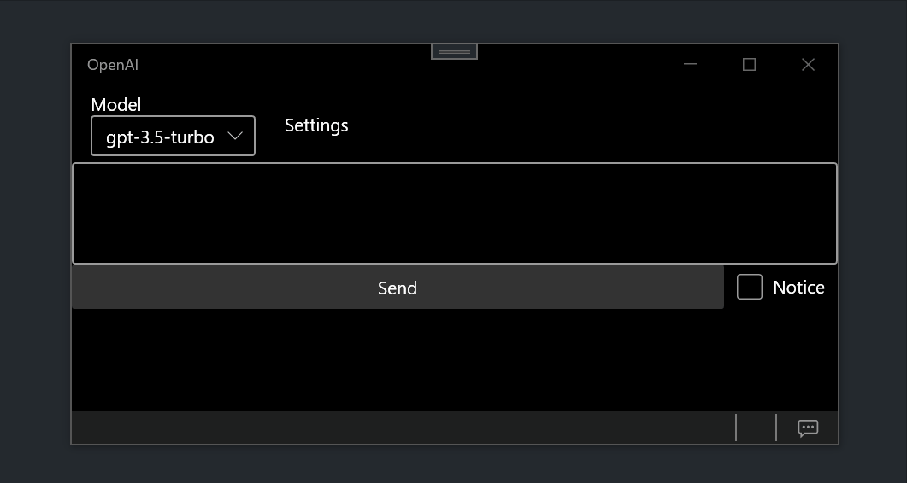

# OpenAIOnWPF

OpenAIOnWPFは、OpenAI APIを使用してデスクトップアプリケーションと対話するためのWPFアプリケーションです。

## Requirement
- Windows 10 or 11

## 使用方法
1. アプリケーションを実行。
2. Configurationコンボボックス横のボタンをクリックして、APIキーを設定。
3. テキストボックスに質問やコメントを入力し、Ctrl + Enterキーを押すか、送信ボタンをクリックして、送信。
4. APIからの応答がアシスタントテキストボックスに表示される。
5. 必要に応じて、さらにメッセージを送信して対話を続ける。

## 機能
### 設定
OpenAIかAzureOpenAIのAPIを使用可能です。

### 会話履歴編集
https://github.com/yt3trees/OpenAIOnWPF/assets/57471763/d7bcb773-9832-44cc-8a97-a3a13e6f8c18

### プロンプトテンプレート
https://github.com/yt3trees/OpenAIOnWPF/assets/57471763/1057896a-3f72-495c-9db7-68223e5d1136

### 翻訳機能
英語以外が母国語の人向け。

英語が一番精度がいいらしい。英語でAIとやり取りしたい場合に使用してください。

DeepLかGoogleの翻訳APIが必要です。

https://github.com/yt3trees/OpenAIOnWPF/assets/57471763/18462921-7c50-45d3-87cd-be751a5a3197

## Author

[@yt3trees](https://twitter.com/yt3trees)

## License

[MIT](https://github.com/yt3trees/OpenAIOnWPF/blob/main/LICENSE)
