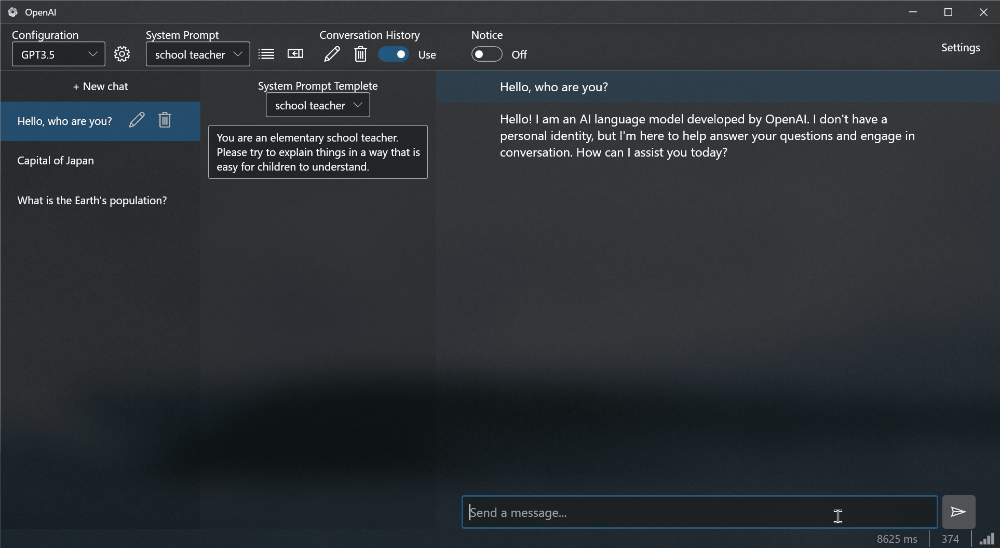

# OpenAIOnWPF

OpenAIOnWPFは、OpenAI APIを使用してデスクトップアプリケーションと対話するためのWPFアプリケーションです。

# Requirement
- Windows 10

## 使用方法
1. アプリケーションを実行。
2. Configurationコンボボックス横のボタンをクリックして、APIキーを設定。
3. テキストボックスに質問やコメントを入力し、Ctrl + Enterキーを押すか、送信ボタンをクリックして、送信。
4. APIからの応答がアシスタントテキストボックスに表示される。
5. 必要に応じて、さらにメッセージを送信して対話を続ける。

## Author

[@yt3trees](https://twitter.com/yt3trees)

## License

[MIT](https://github.com/yt3trees/OpenAIOnWPF/blob/main/LICENSE)